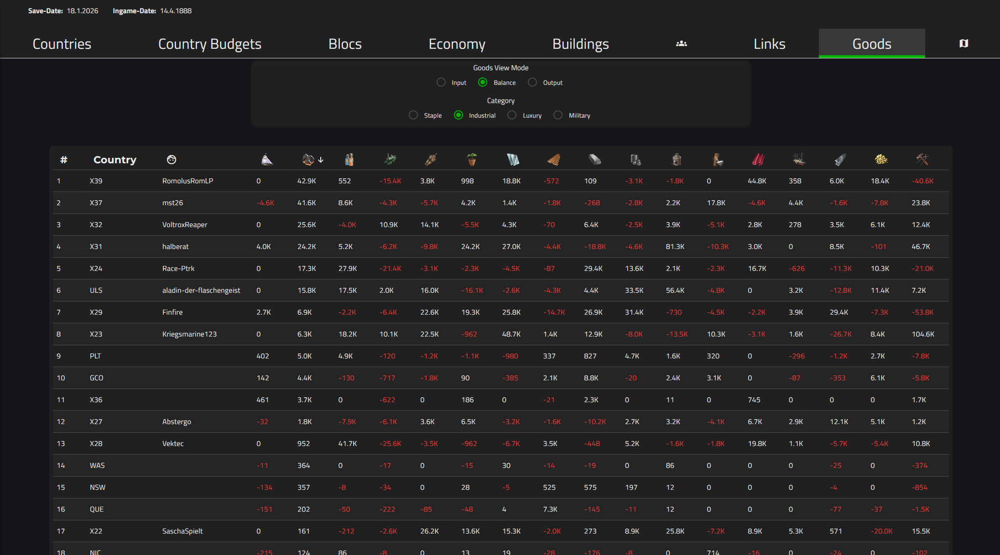
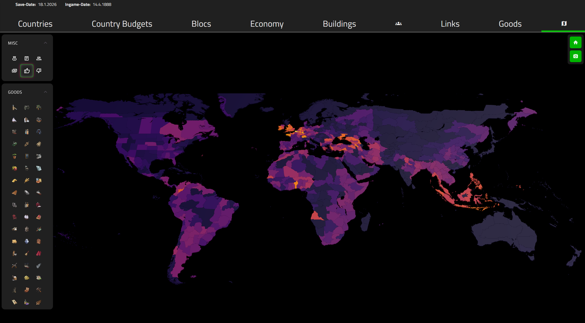

# Backend Service Repositories
- [Authentication](https://github.com/phinfire/authenticationService)
- [MegaCampaign-Signup and Administration](https://github.com/phinfire/MC-Signup-Backend)
- [Interacting with Discord](https://github.com/phinfire/miniDiscordGateway)
- [CRUD Database + Proxying the Skanderbeg API](https://github.com/phinfire/skanderbegGateway)

# Features

## Save Analyzer

Using [Jomini](http://www.npmjs.com/package/jomini/) the save analyzer can parse Crusader Kings 3, Europa Universalis 4 and Victoria 3 save files first into an intermediate JSON representation, and then into their respective TypeScript models.

Once a save has been parsed, authorized users may upload its parsed representation to the database for later retrieval.
Uploaded saves can directly be accessed using their ID as a route parameter to enable easy sharing with others.

Relevant per player (=country/character) values are displayed in a set of tables.

Per state values (e.g. population, produced goods) can be visualized using an interactive map.

# Implementation

# Saves and associated data handling
When uploading a save file (not just opening it using the analyzer), the SaveSaverService will also create and upload reduced views of the save file for faster and less bandwidth-intensive access by other parts of the application. E.g. the "demography" data for Vic3 saves to be used by the alliance helper

## Viewer Components
### TableComponent<T>
Uses Angular's MatTable to show a sortable table. Dynamically adapts to changes in data source and columns.
Columns can be created via a dedicated builder and support tooltips, cell and header images, 
### SlabMapView
Uses GEOJSON precomputed from the respective game files to generate a polygonal map with individual meshes corresponding to in-game states/provinces.
These can be colored and color coded using input view modes.

## Parsing CK3 Save Files
    - Character
    - LandedTitle
    - Holding
    - Culture
    - Faith

## VIC3 - SAVE MODEL
    - Save contains Countries
    - Countries contain States
    - States contain Buildings

## Input Data
    - SlabMapView/PolygonSelectComponent need the respective GEOJSON
    - MCSignup: Initial save file
    - CK3: /landed_titles as JSON